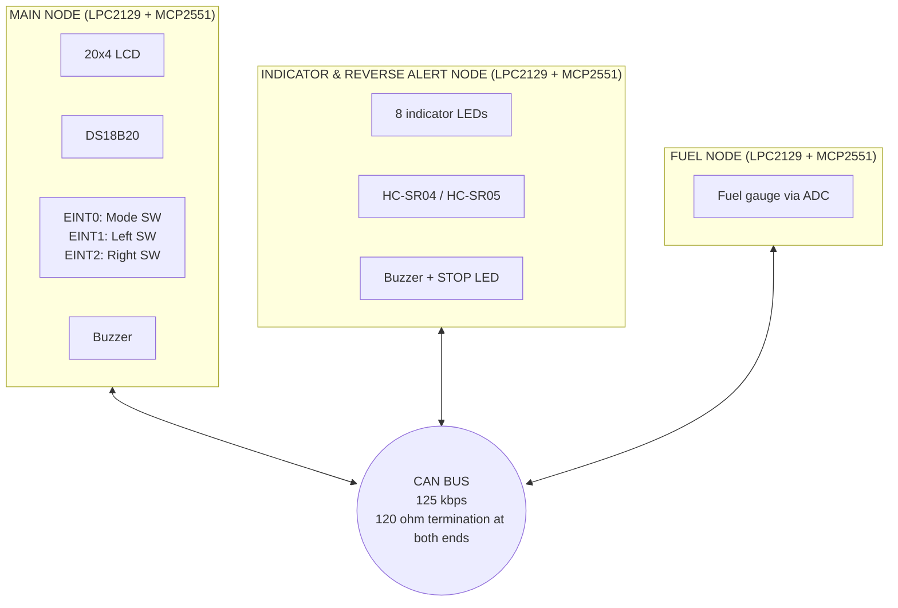
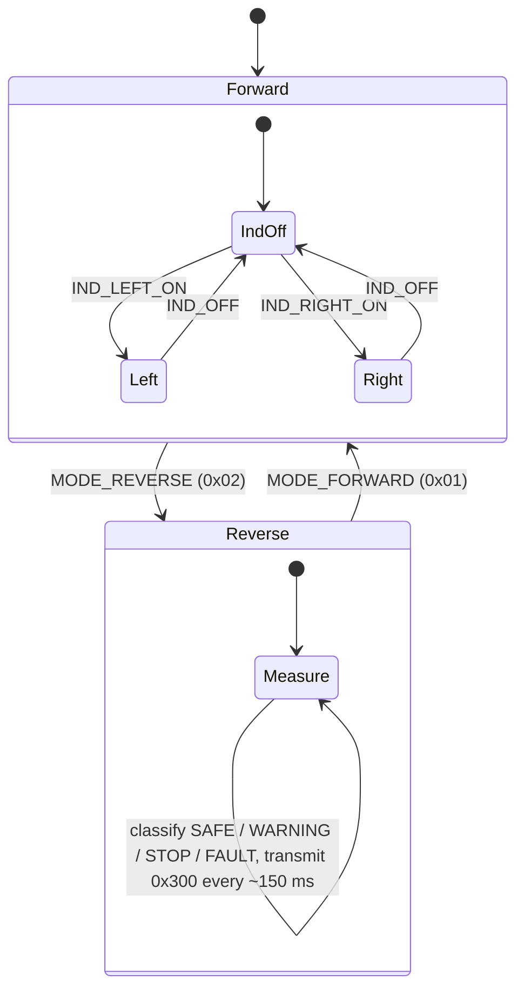

# CAN-Driven Vehicle Monitoring & Driver Assistance System

A three-node automotive-style network built on **NXP LPC2129 (ARM7TDMI-S)** boards. The nodes talk over a **CAN 2.0A bus at 125 kbps** to monitor fuel level and engine temperature, control turn indicators, and warn the driver of obstacles while reversing. A central dashboard (20x4 LCD) shows live vehicle status.


---

## Table of Contents

- [Features](#features)
- [System Architecture](#system-architecture)
- [Hardware](#hardware)
- [Pin Maps](#pin-maps)
- [CAN Protocol Design](#can-protocol-design)
- [Node Behaviour](#node-behaviour)
- [LCD Dashboard](#lcd-dashboard)
- [Repository Structure](#repository-structure)
- [Build & Flash](#build--flash)
- [Bring-up & Test Plan](#bring-up--test-plan)
- [Known Limitations & Roadmap](#known-limitations--roadmap)
- [Troubleshooting](#troubleshooting)
- [License](#license)

---

## Features

| Area | What it does |
|---|---|
| **Fuel monitoring** | 10-bit on-chip ADC reads a float-type fuel gauge, converts to 0-100 %, and sends it over CAN periodically and on significant change |
| **Engine temperature** | DS18B20 (1-Wire, bit-banged) read by the Main Node and shown on the dashboard |
| **Mode selection** | External-interrupt switch toggles **Forward / Reverse**; the mode is broadcast to the other nodes |
| **Turn indicators** | Left/Right switches (external interrupts) send commands; 8 LEDs scroll right-to-left (left) or left-to-right (right) |
| **Reverse assist** | HC-SR04/HC-SR05 ultrasonic ranging in Reverse mode with **SAFE / WARNING / STOP** zones, intermittent or continuous buzzer, and a STOP LED |
| **Fault reporting** | "No echo" from the ultrasonic sensor is reported as `FAULT`, not mistaken for "path clear" |
| **Dashboard** | 20x4 LCD with custom CGRAM glyphs: 5-level fuel icon and blinking turn arrows |

---

## System Architecture



**Data flow**

| From | To | Message | Purpose |
|---|---|---|---|
| Fuel Node | Main Node | `0x100` | Fuel percentage |
| Main Node | Indicator & Reverse Node | `0x200` | Vehicle mode and indicator commands |
| Indicator & Reverse Node | Main Node | `0x300` | Reverse status and distance |

---

## Hardware

| Qty | Component | Notes |
|---|---|---|
| 3 | Vector LPC2129 CAN node boards (Series 1.2) | 12 MHz crystal, on-board CAN transceiver (MCP2551), UART ISP |
| 1 | JHD204A 20x4 character LCD (HD44780) | 8-bit mode, Main Node |
| 1 | DS18B20 temperature sensor + **4.7 kOhm pull-up** | Main Node |
| 1 | Float-type fuel gauge (variable resistor / potentiometer-style) | Fuel Node, ADC input |
| 1 | HC-SR04 / HC-SR05 ultrasonic sensor | Indicator Node |
| 8 + 1 | LEDs (indicators + STOP LED) | Indicator Node |
| 2 | Buzzers | Main Node and Indicator Node |
| 3 | Push buttons | Mode, Left, Right (Main Node) |
| 2 | 120 Ohm resistors | Bus termination at both ends |
| 1 | USB-to-UART converter | Flashing via ISP |

> The LPC2129 runs at **CCLK = 60 MHz** (12 MHz x 5 via PLL) with **PCLK = 15 MHz** (VPBDIV at reset value). Timing constants in `can_defines.h`, `ADC_defines.h` and `hcsr04.c` assume this.

---

## Pin Maps

### Main Node

| Function | Pin |
|---|---|
| LCD D0-D7 | P0.8 - P0.15 |
| LCD RS / RW / EN | P0.16 / P0.17 / P0.18 |
| Buzzer (mirrors STOP) | P0.19 |
| DS18B20 DQ (4.7 kOhm pull-up to VDD) | P0.20 |
| Mode switch, EINT0 (active low) | P0.1 |
| Left indicator switch, EINT1 (active low) | P0.3 |
| Right indicator switch, EINT2 (active low) | P0.7 |
| CAN1 | TD1 (dedicated), RD1 = P0.25 |

### Indicator & Reverse Alert Node

| Function | Pin |
|---|---|
| 8 indicator LEDs | P0.0 - P0.7 |
| Reverse Alert (STOP) LED | P0.19 |
| Buzzer | P0.20 |
| HC-SR04 TRIG / ECHO | P0.16 / P0.17 |
| CAN1 | TD1 (dedicated), RD1 = P0.25 |

### Fuel Node

| Function | Pin |
|---|---|
| Fuel gauge wiper | P0.28 / AD0.1 (channel 1) |
| CAN1 | TD1 (dedicated), RD1 = P0.25 |

---

## CAN Protocol Design

All IDs and payload codes live in a single shared header, `can_ids.h`. **It must be identical on all three nodes.**

### Message map (11-bit standard identifiers)

| ID | Direction | DLC | Payload (`Data1`) |
|---|---|---|---|
| `0x100` `CAN_ID_FUEL_LEVEL` | Fuel -> Main | 1 | byte 0 = fuel % |
| `0x200` `CAN_ID_MODE_INDICATOR` | Main -> Indicator | 1 | byte 0 = command (below) |
| `0x300` `CAN_ID_REVERSE_STATUS` | Indicator -> Main | 3 | byte 0 = status, bytes 1-2 = distance in cm (little-endian) |

**Commands on `0x200`**

| Code | Name | Meaning |
|---|---|---|
| `0x01` | `MODE_FORWARD` | Switch to Forward mode |
| `0x02` | `MODE_REVERSE` | Switch to Reverse mode (enables ultrasonic sensing) |
| `0x10` | `IND_OFF` | All indicator LEDs off |
| `0x11` | `IND_LEFT_ON` | Left indicator on |
| `0x12` | `IND_RIGHT_ON` | Right indicator on |

**Status codes on `0x300`**

| Code | Name | Condition (defaults) |
|---|---|---|
| `0x01` | `REV_STATUS_SAFE` | distance > 100 cm |
| `0x02` | `REV_STATUS_WARNING` | 40 cm < distance <= 100 cm |
| `0x03` | `REV_STATUS_STOP` | distance <= 40 cm |
| `0x04` | `REV_STATUS_FAULT` | no echo from sensor |

Thresholds are `SAFE_DIST_CM` and `WARN_DIST_CM` in `IndicatorReverseAlertNode/main.c`.

### Bit timing (derived in `can_defines.h`)

| Parameter | Value |
|---|---|
| Bit rate | 125 kbps |
| PCLK | 15 MHz |
| Time quanta per bit | 15 |
| BRP | 8 |
| TSEG1 / TSEG2 | 9 / 5 |
| Sample point | about 67 % |
| SJW | 4 |

### Arbitration priority

CAN arbitration favours the **lower** ID, so the current order is Fuel (`0x100`) > Mode/Indicator (`0x200`) > Reverse status (`0x300`). If you want safety-relevant traffic to win under load, renumber IDs in `can_ids.h`. No other code changes are needed.

### Acceptance filter

The acceptance filter runs in **bypass mode** (`AFMR.AccBP`), so every frame on the bus is received and each node filters by ID in software.

---

## Node Behaviour

### Main Node: the central controller

- Reads engine temperature (DS18B20) and displays it.
- Receives fuel % from the Fuel Node and shows it with a 5-level icon.
- **EINT0** toggles Forward/Reverse and sends `MODE_FORWARD` / `MODE_REVERSE`.
- **EINT1 / EINT2** (Forward mode only) toggle the Left/Right indicator and send `IND_LEFT_ON`, `IND_RIGHT_ON` or `IND_OFF`. The two indicators are mutually exclusive.
- In Reverse mode, receives distance and status, shows it on the LCD, and drives its own buzzer on STOP.

### Indicator & Reverse Alert Node



- **Forward:** ultrasonic sensing is disabled. Left scrolls LEDs P0.7 -> P0.0; Right scrolls P0.0 -> P0.7 (120 ms per step).
- **Reverse:** indicators are forced off. The HC-SR04 is triggered continuously, and the buzzer and LED follow the zone:

| Zone | Buzzer | STOP LED | Status sent |
|---|---|---|---|
| SAFE | off | off | `SAFE` |
| WARNING | intermittent | off | `WARNING` |
| STOP | continuous | on | `STOP` |
| No echo | intermittent | off | `FAULT` |

- Echo width is time-stamped with a **Timer0 1 us hardware tick** rather than busy-loop counting. Distance (cm) = echo width (us) / 58.

### Fuel Node

- Samples AD0.1 and converts to a percentage: `percent = ADC * 100 / 1023`.
- Transmits when the value changes by at least `FUEL_CHANGE_THRESHOLD` (2 %), plus a keep-alive roughly every 500 ms.

---

## LCD Dashboard

20x4 layout (Main Node). The fuel icon and arrows are custom CGRAM characters.

```
TEMP:32 C
FUEL:45%  [fuel icon]
MODE:FWD                      <- Forward
REV:85CM WARNING              <- Reverse (SAFE / WARNING / STOP! / SENSOR FAULT)
L:<     R:                    <- active indicator arrow blinks
```

<!-- Add photos of your build here, e.g.


-->

---

## Repository Structure

```
.
├── MainNode/                    # Dashboard, DS18B20, EINT switches, CAN RX/TX
│   ├── main.c  lcd.c  ds18b20.c  can.c  delay.c  pin_connect_block.c
│   ├── can_ids.h  can_defines.h  lcd_defines.h  ...
│   └── mainupdate.uvproj        # Keil project
├── FuelNode/                    # ADC fuel sensing + CAN TX
│   ├── main.c  ADC.c  can.c  ...
│   └── fuel.uvproj
├── IndicatorReverseAlertNode/   # LED indicators, HC-SR04, buzzer, CAN RX/TX
│   ├── main.c  hcsr04.c  can.c  ...
│   └── indicatorupdate.uvproj
└── docs/                        # Project brief, block diagram, photos
```

Each node is an independent Keil project. `can.c`, `can.h`, `can_defines.h`, `can_ids.h`, `types.h`, `defines.h`, `delay.*` and `pin_connect_block.*` are shared across nodes, so keep the copies in sync.

---

## Build & Flash

**Requirements:** Keil uVision (ARM7 / MDK-ARM with LPC2129 support), Flash Magic, a USB-to-UART converter.

1. Open the node's project: `mainupdate.uvproj`, `fuel.uvproj` or `indicatorupdate.uvproj`.
2. Confirm target **LPC2129** and **12 MHz** crystal (already set in the projects).
3. *Project -> Build Target.* Make sure *Create HEX File* is enabled.
4. Put the board in ISP mode (ISP switch on the Vector board) and connect the USB-UART converter to UART0.
5. In Flash Magic: select device **LPC2129**, the correct COM port and baud rate, oscillator **12 MHz**, then load the `.hex` and click **Start**.
6. Return the ISP switch to run mode and reset the board.
7. Repeat for the other two nodes, then connect **CANH-CANH** and **CANL-CANL** across all three boards. Fit **120 Ohm termination at both ends of the bus only**.

---

## Bring-up & Test Plan

Test each module on its own before integrating. This order is the one used for the project.

| # | Test | Pass criteria |
|---|---|---|
| 1 | LCD | Character, string and integer constants render correctly |
| 2 | ADC | Potentiometer sweep shows 0-1023 on the LCD |
| 3 | Fuel logic | Fuel % tracks the gauge from 0 to 100 |
| 4 | External interrupts | Press count increments on the LCD for each of EINT0/1/2 |
| 5 | HC-SR04 | Distance matches a tape measure at several positions |
| 6 | DS18B20 | Temperature reads plausibly and changes when warmed by hand |
| 7 | Basic CAN | Loopback or two-node send/receive of a test frame |
| 8 | Integration | Fuel % on dashboard; mode toggles; indicators scroll; reverse zones and buzzer behave as per the tables above |

---

## Known Limitations & Roadmap

These are known trade-offs of the current version.

| Limitation | Impact | Suggested improvement |
|---|---|---|
| `Read_DS18B20_TempC()` blocks about 750 ms every loop | LCD refresh and CAN polling are slow; the LPC2129 has a single RX buffer, so frames can be overwritten between reads | Start conversion, then read the result on the next pass (non-blocking state machine), or use a CAN RX interrupt |
| 200 ms blocking debounce inside the EINT ISRs, and `CAN1_Tx()` called from ISRs and from `main` | Long ISR latency; possible contention on TX buffer 1 | Set a flag in the ISR and transmit from the main loop; debounce with a timer |
| `CAN1_Tx()` busy-waits on `TCS1` with no timeout | A node transmitting alone on a disconnected or unacknowledged bus will hang | Add a timeout, check error and bus-off status, and recover |
| Fuel is a single raw ADC sample | Display may jitter by 1-2 % | Moving average over N samples and hysteresis on the displayed value |
| Fuel curve is a linear 0-100 % map | A real float sender is non-linear and needs calibration | Lookup table or per-tank calibration constants |
| Software delays (`delay_ms/us`) are loop-calibrated for 60 MHz CCLK | Timing changes if the clock or optimization level changes | Replace with hardware timers |
| No heartbeat or timeout on received data | The Main Node shows stale fuel/reverse data if a node dies | Add node-alive timeouts and a "NO DATA" display state |
| IDs ordered by function, not by safety priority | Fuel traffic wins arbitration over reverse alerts | Renumber IDs in `can_ids.h` (see [Arbitration priority](#arbitration-priority)) |

---

## Troubleshooting

| Symptom | Likely cause |
|---|---|
| LCD shows leftover characters after a screen change | Missing clear delay or short strings not padded to 20 characters |
| `TEMP: -999` | DS18B20 not detected: check DQ wiring (P0.20) and the 4.7 kOhm pull-up |
| `TEMP: 85` right after power-up | DS18B20 power-on default; a read happened before the first conversion finished |
| `REV: SENSOR FAULT` | No echo: check TRIG/ECHO wiring, the sensor's 5 V supply, and that nothing blocks the sensor face |
| Nodes don't communicate | Bit-timing mismatch, missing termination, swapped CANH/CANL, or different `can_ids.h` across nodes |
| Node freezes on first transmit | No other node is acknowledging frames on the bus (see CAN TX timeout item above) 


